# Bitácora

La bitácora reúne entradas periódicas detallando el estado del proyecto en la fecha de su escritura. Se incluyen notas posteriores, que aclaran confusiones o diferencias de planes, que expliquen las diferencias más amplias con el producto final.

[TOC]

## 18 de Abril

### Frontend

Comienza el trabajo y con él la familiarización con las tecnologías del entorno de React Native, que hasta ahora son prácticamente desconocidas.  Gradualmente se desarrollan aplicaciones de mayor compeljidad:

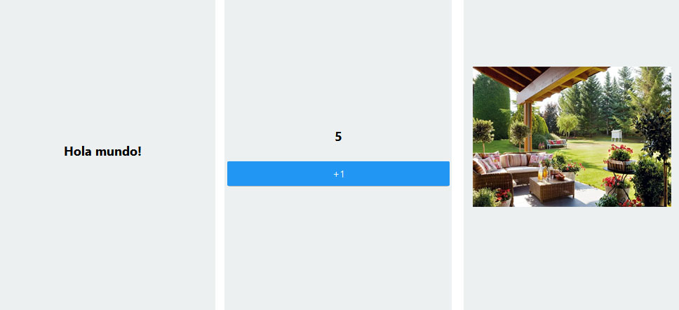

Las principales prioridades son definir un esquema general de la aplicación para organizar la navegación y determinar el modo en que se enseñarán los proyectos, que son el componente fundamental de toda la aplicación.

Se evaluaron bibliotecas de interfaz de usuario como UI Kitten, React Native UI Lib  y React Native Paper. Se optó por emplear esta última, pues su uso era sencillo y ofrecía un aspecto profesional y fluído.

## 13 de Mayo

### Frontend

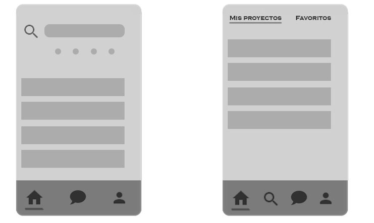

Inicialmente se dividieron las funciones de la aplicaciones en tres categorías: Proyectos, Mensajería y Perfiles (ver mockup izquierdo). En futuras iteraciones se determinó que, aunque la lectura inicial se simplificaría, la pantalla inicial contendría demasiada información y  que sería engorroso tener que seleccionar opciones del apartado de búsqueda para visualizar proyectos favoritos, patrocinados, etc  (ver mockup derecho).

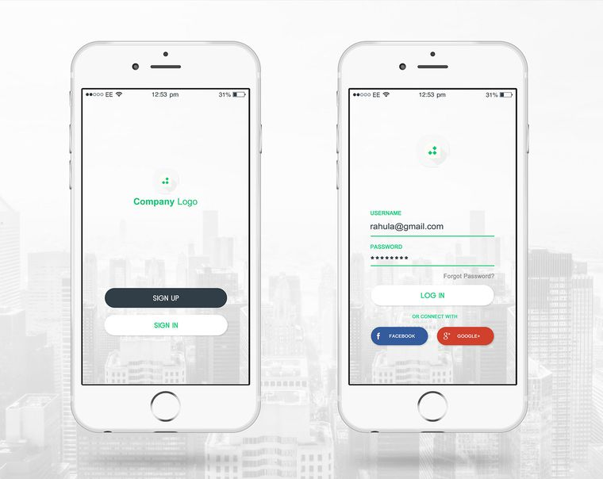

Para el registro y login no se plantea un diseño especialmente innovador, el esquema tradicional es eficaz.

Se trabaja en implementar dichas pantallas y especialmente en integrar el login con firebase.

## 20 de Mayo

### Frontend

#### Pantalla Inicial

Cuando el usuario inicia la aplicación se encuentra con una pantalla en donde puede decidir si ingresar (con login corriente o federado) o registrarse. De ser posible, una vez que el usuario se ha registrado por primera vez, el ingreso se realizará automáticamente.

#### Pantalla de Registro

Se presentan múltiples campos que el usuario debe completar. Textos auxiliares en rojo informan errores.

En el futuro el botón de registro se deshabilitará hasta que no se detecten errores locales en los campos.

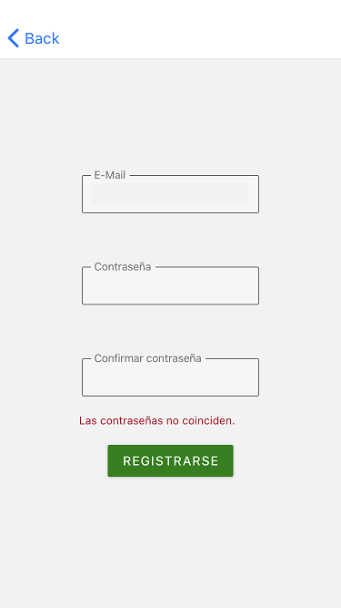

#### Pantalla de Ingreso

Análoga a la pantalla de registro.

#### Pantalla de Registro de Datos

Si el servidor no posee datos adicionales del usuario se lo conduce a la pantalla de registro de datos tras un ingreso/registro exitoso. El campo de fecha de nacimiento incluye formateo automático.

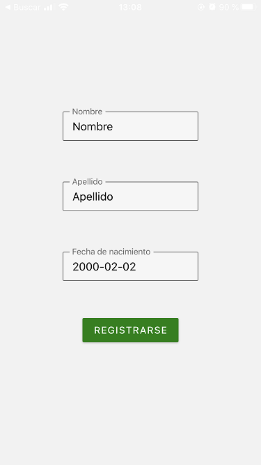

#### Pantalla Home

Cumple un doble propósito: Sirve de punto de entrada a la aplicación y presenta al usuario dos áreas de especial interés: sus proyectos y aquellos que considere favoritos.  Se listan tarjetas que reúnen un título y una imagen representativa.  Actualmente se debate si es conveniente trasladar las opciones que se presentan debajo al interior del proyecto y acceder al mismo solo con un click/toque sobre la tarjeta.

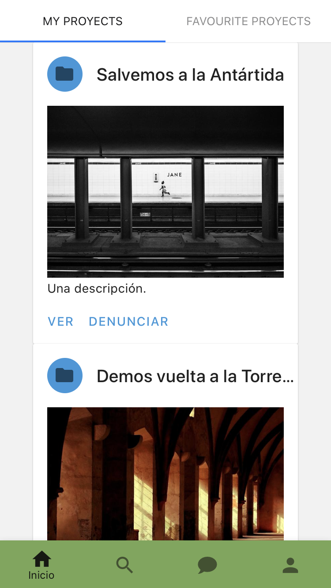

Para pasar de un área a otra basta con deslizar hacia los lados.

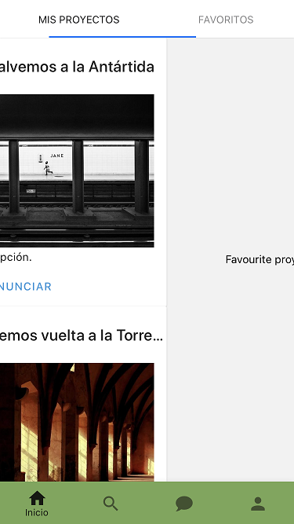

Debajo, una barra de aplicaciones permite navegar entre el resto de las pantallas principales,  mostradas a continuación.

#### Pantalla Búsqueda

El menú que permite buscar por diversos criterios se desplegará solo cuando el usuario selecciona la barra. 

Tras una búsqueda se presentará un listado muy similar al de Home.

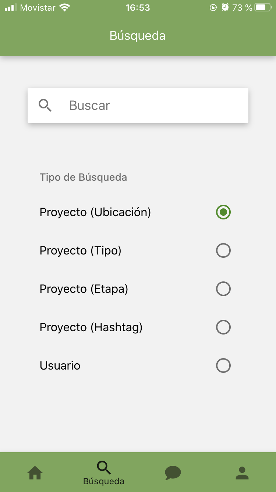

*Retrospectiva: Inicialmente los usuarios se buscarían junto con los proyectos. Más tarde se decidió que tal enfoque no era intuitivo, ni sencillo de implementar. Además el objetivo del chat no es conectar con amigos o socios, sino con los dueños de los proyectos, por lo que tiene más sentido acceder a la conversación desde un proyecto.*

#### Pantalla de Mensajería

Esta pantalla reúne a aquellos usuarios con los que se haya comunicado mediante mensaje privado. El mecanismo de navegación entre salas y el propio intercambio de chats funciona a nivel de mockups. 

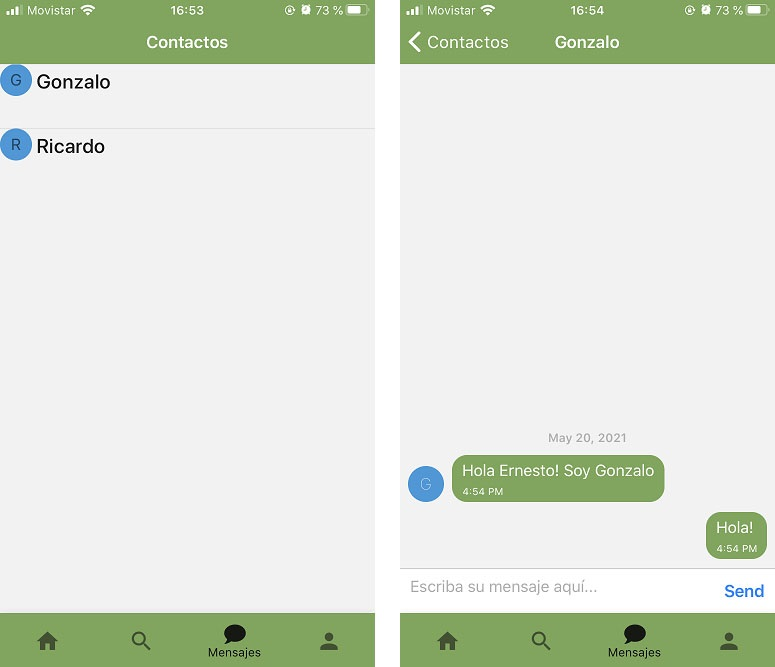

El modo en que se interactúa por primera vez  con otro usuario aún no se ha determinado.

#### Pantalla de Cuenta

El contenido de esta pantalla es muy pobre de momento y quizás ni siquiera se permita establecer una imagen de perfil. Desde luego, se incorporarán campos y opciones de cuenta conforme evolucione la aplicación.

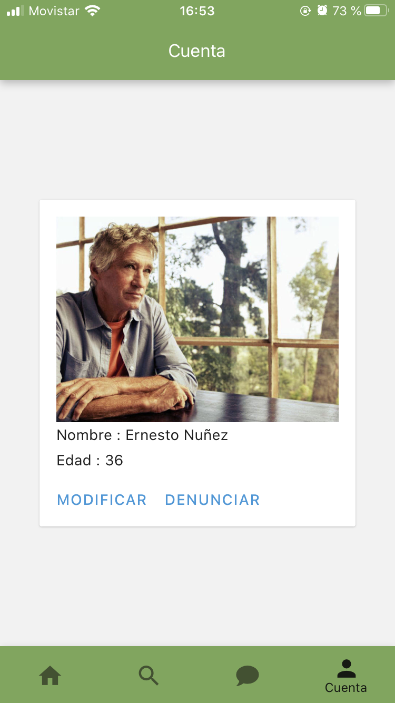

## 27 de Mayo

### Frontend

#### Veeduría

La sección de veeduría atraviesa varios de los procesos que involucra el trabajo. Se debatió entre añadir una nueva pestaña a la barra inferior o simplemente incluirlo en una sub-pestaña de proyectos. Tras un largo debate se optó por la segunda opción, pero cambiando las secciones a íconos, para simplificar el aspecto.

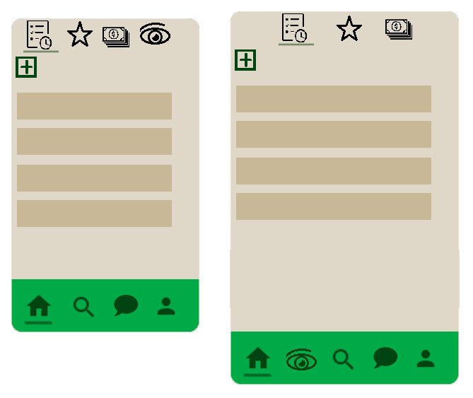

#### Creación y visualización de proyectos

Habiendo establecido la estructura y tema general de la aplicación, es prioritario terminar de decidir el diseño de los proyectos, tanto a la hora de su creación, como al momento de su visualización.

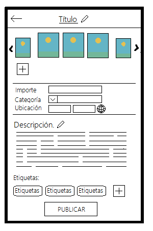

*Retrospectiva: Notar la ausencia de las etapas fijadas por el usuario. En un principio el equipo del front-end las había confundido por los estados del proyecto. Por ello el importe se establece en un único lugar.*

Respecto a la ubicación en la creación del proyecto, actualmente investigamos servicios de terceros que permitan indicarla de un modo más ameno, sin tener que conocer explícitamente la longitud y latitud del lugar que se requiere.

El ícono de lápiz, que permite editar la descripción solo aparecerá cuando el dueño visualice su propio proyecto. Los comentarios públicos pueden no incluírse en la versión final, pero de desarrollarse definitivamente se ubicarán debajo de todos los demás componentes.

## 6 de Junio

### Frontend

#### Subida de imágenes

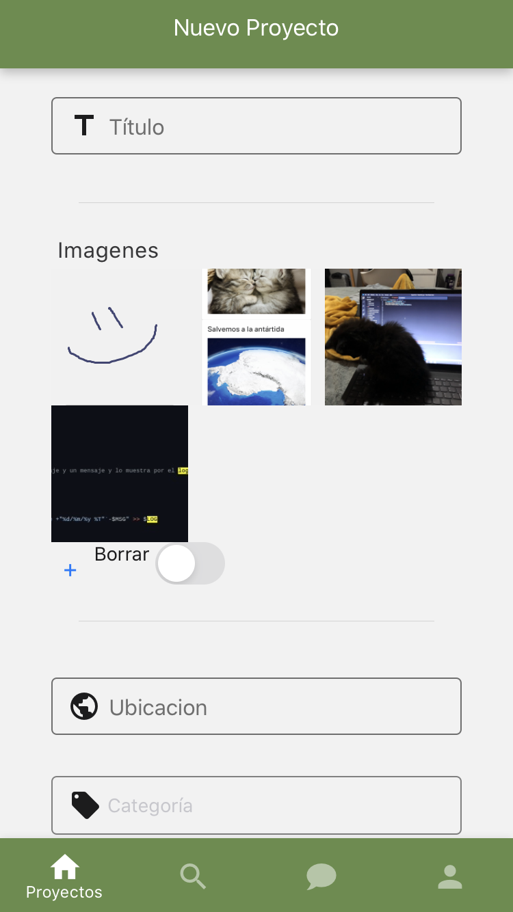

Las pantallas anteriormente descritas funcionan, aunque con algunos errores. Hemos implementado una grilla de imágenes en la creación del proyecto, de forma tal que un usuario puede reordenar las imágenes que carga sin tener que borrarlas y resubirlas. Esto también soluciona el problema de cuál imagen mostrar en las búsquedas, pues si reordenar es sencillo, puede tomarse la primera de ellas como portada.

#### Ubicación

La biblioteca de Google Places Autocomplete provee un componente que se ajusta a nuestras necesidades, aunque presenta muchos problemas a la hora de renderizarse.

 

## 13 de Junio

### Frontend

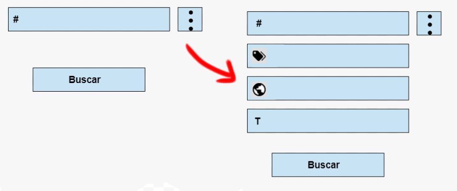

Se trabaja en la integración de las búsquedas. La pantalla anterior recordaba demasiado a un formulario, donde la mayor parte de las opciones no se utilizaban.  Se modifico a un menú desplegable, donde la opción de búsqueda por defecto es por tags, y tocando en los 3 puntos el usuario puede acceder a los otros criterios , y si lo desea combinarlos.

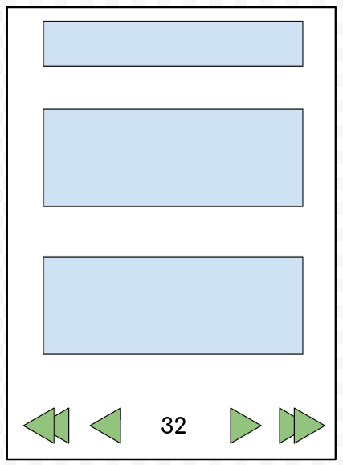

La administración del componente de paginación presentó grandes desafíos que pudieron para resolverse precisaron un replanteamiento total de la pantalla.

## 20 de Junio

### Frontend

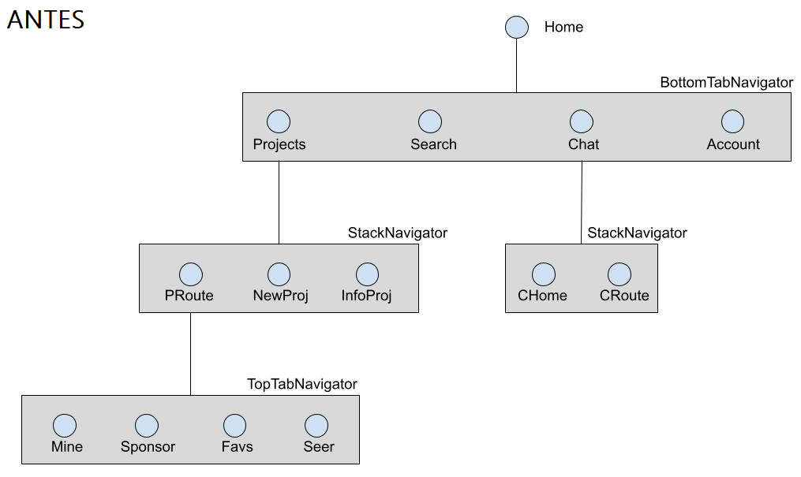

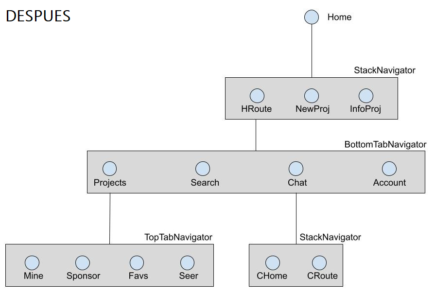

Como parte de la refactorización de procesos, se replanteó la jerarquía de pantallas respecto a su navegación.

## 27 de Junio

### Frontend

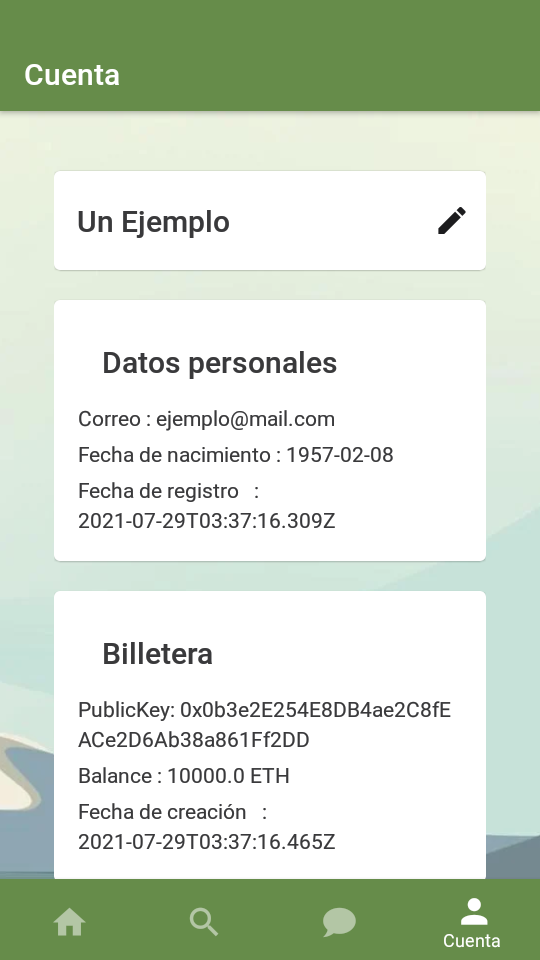

Para reflejar las nuevas características del back-end se actualizó el perfil, con un fondo agradable y nueva información de billeteras, veeduría y cierre de sesión.

## 8  de Julio

### Frontend

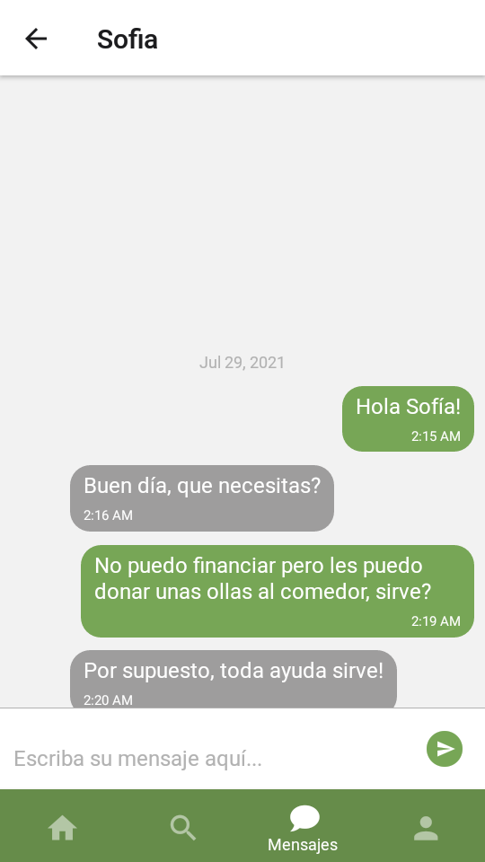

Se solucionan errores y se refactoriza código.  Se pule la interfaz agregando pantallas de carga, mensajes de errores y mejor feedback ante el usuario.

## 15 de Julio

### Frontend

Se terminó de implementar la funcionalidad del chat aprovechando la base de datos en tiempo real de Firebase. Se determinó que el contacto inicial se realice exclusivamente a través del perfil al que se accede dentro de la vista de proyecto. La sincronización de contactos conllevó sortear algunas dificultades menores, pero el resultado es robusto.

## 22 de Julio

### Frontend

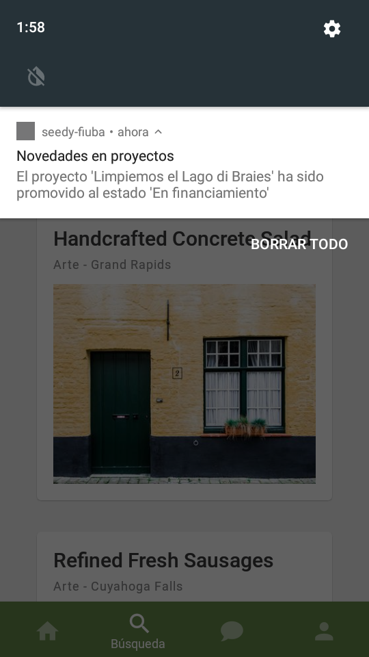

Implementar las notificaciones resultó mucho más complicado de lo esperado, pues el soporte de Firebase en Android e IOS es parcial. Tras múltiples intentos fallidos de evitar o circunventar éstas incompatibilidades afortunadamente se descubrió que el servicio de notificaciones de Expo es independiente de Firebase. 

## 29 de Julio

### Frontend

Se solucionan errores y se pule la interfaz agregando pantallas de carga, mensajes de errores y mejor feedback ante el usuario.

