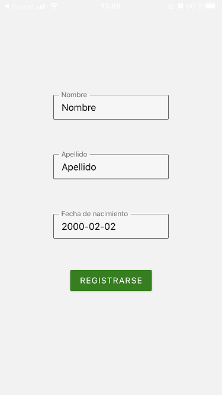
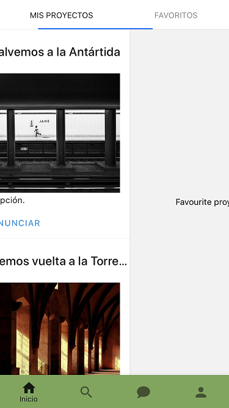
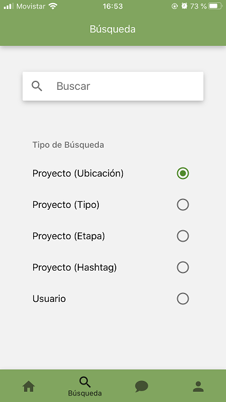
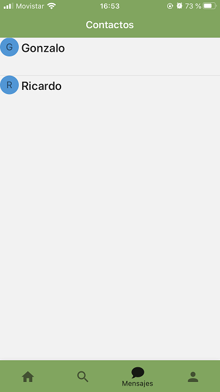
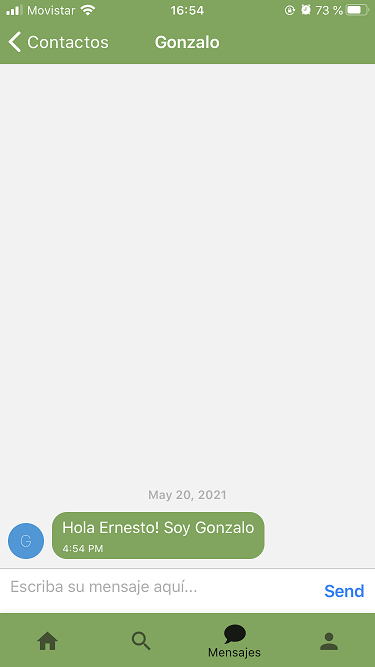
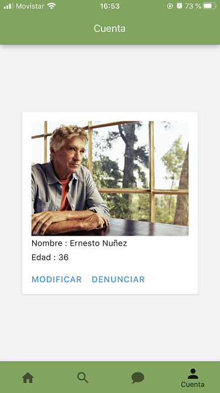

## Pantalla Inicial

Cuando el usuario inicia la aplicación se encuentra con una pantalla en donde puede decidir si ingresar (con login corriente o federado) o registrarse. De ser posible, una vez que el usuario se ha registrado por primera vez, el ingreso se realizará automáticamente.

## Pantalla de Registro

Se presentan múltiples campos que el usuario debe completar. Textos auxiliares en rojo informan errores.

En el futuro el botón de registro se deshabilitará hasta que no se detecten errores locales en los campos.

## Pantalla de Ingreso

Análoga a la pantalla de registro.

## Pantalla de Registro de Datos

Si el servidor no posee datos adicionales del usuario se lo conduce a la pantalla de registro de datos tras un ingreso/registro exitoso. El campo de fecha de nacimiento incluye formateo automático.

## Pantalla Home

Cumple un doble propósito: Sirve de punto de entrada a la aplicación y presenta al usuario dos áreas de especial interés: sus proyectos y aquellos que considere favoritos.  Se listan tarjetas que reúnen un título y una imagen representativa.  Actualmente se debate si es conveniente trasladar las opciones que se presentan debajo al interior del proyecto y acceder al mismo solo con un click/toque sobre la tarjeta.

Para pasar de un área a otra basta con deslizar hacia los lados.

Debajo, una barra de aplicaciones permite navegar entre el resto de las pantallas principales,  mostradas a continuación.

## Pantalla Búsqueda

El menú que permite buscar por diversos criterios se desplegará solo cuando el usuario selecciona la barra. 

Tras una búsqueda se presentará un listado muy similar al de Home.

## Pantalla de Mensajería

Esta pantalla reúne a aquellos usuarios con los que se haya comunicado mediante mensaje privado.

El modo en que se interactúa por primera vez  con otro usuario aún no se ha determinado.

## Pantalla de Cuenta

El contenido de esta pantalla es muy pobre de momento y quizás ni siquiera se permita establecer una imagen de perfil. Desde luego, se incorporarán campos y opciones de seguridad de cuenta conforme evolucione la aplicación.

### 22/05/21