# Manual de Usuario

## Índice

[TOC]

## Introducción

Sea usted bienvenido a la comunidad 'Seedyfiuba'. En el presente documento encontrará una guía ilustrada detallada respecto a las principales características de la aplicación 'Seedyfiuba App'.

## Primeros pasos

Si es la primera vez que utiliza la aplicación, debe crear una cuenta o ingresar con uno de los servicios de terceros provistos. En esta sección se discute la creación de una nueva cuenta y el ingreso mediante una cuenta propia o a través de un servicio de terceros.

### Creación de cuenta

1. Seleccione Registrarse.

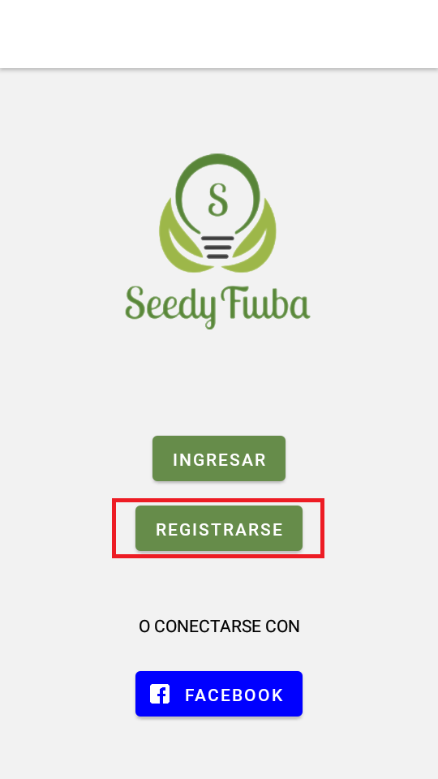

2. Ingrese su email y una contraseña. La contraseña debe contener al menos 6 caracteres.

3. Seleccione Registrarse.

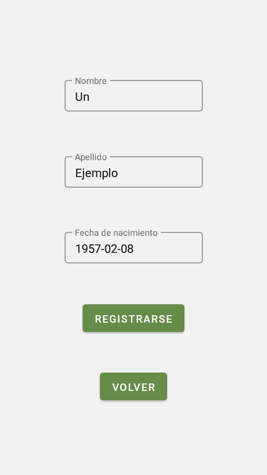

4. Se solicitarán su nombre, apellido y fecha de nacimiento. Para el formato de esta última referirse al ejemplo provisto. Podrá editar su nombre y/o apellido más adelante, pero recuerde que todos los datos serán visibles ante terceros.

   

5. Finalmente, seleccione Registrarse. Usted será redirigido a la página de inicio, para futuros ingresos referirse a la siguiente sección.

   

### Ingresos desde cuenta propia

1. Selecciones Ingresar.

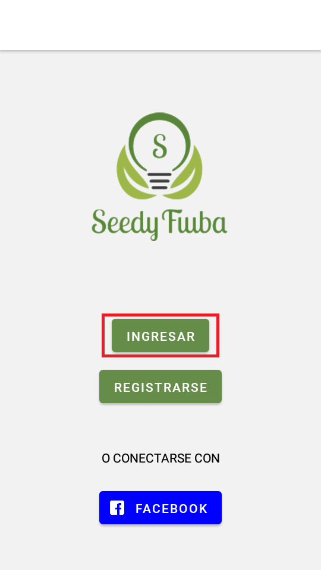

2. Ingrese el mail con el que se registró y la contraseña que ha seleccionado.

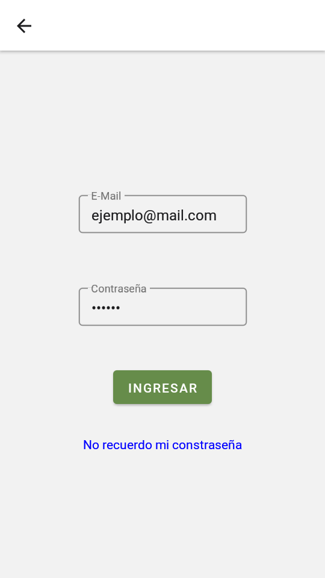

3. Seleccione Registrarse. Usted será redirigido a la página de inicio, para futuros ingresos referirse a la siguiente sección.

   

### Olvido de contraseña

1. Selecciones Ingresar

2. Seleccione 'No recuerdo mi contraseña'

3. Ingrese su correo y seleccione Enviar correo.

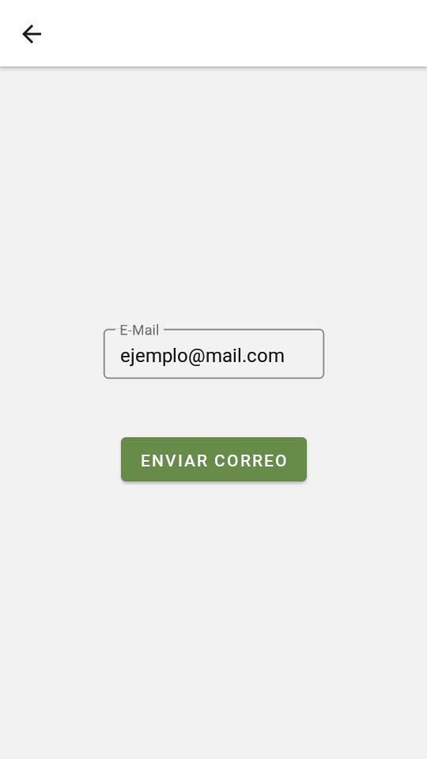

4. Se enviará a su casilla de correo un mensaje similar al enseñado.

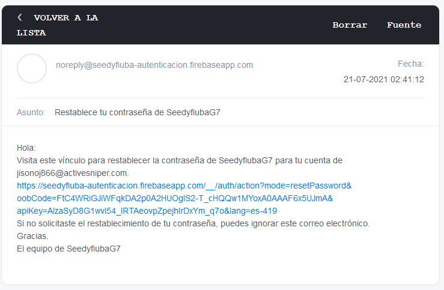

5.  Siga el enlace provisto en azul, ingrese la nueva contraseña y seleccione Guardar.

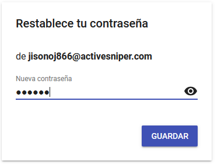

6. Su contraseña se cambiará a la señalada. Continúe según los pasos de **Ingreso desde cuenta propia**.

### Ingreso desde aplicaciones de terceros

1. 

### Administración de cuenta

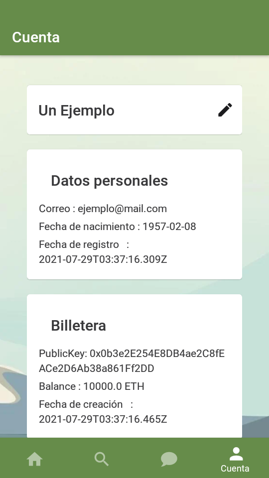

La cuarta pestaña de la barra inferior se denomina 'Cuenta'. En ella puede consultar sus datos personales, modificar su nombre y apellido, aplicar para ser veedor (se explica en la sección correspondiente) y cerrar sesión.

## Exploración de proyectos

El corazón de la aplicación son los proyectos que los usuarios crean, financian y realizan. En esta sección se discute su descubrimiento.

### Búsquedas

1. La segunda pestaña de la barra inferior corresponde a la sección de búsquedas. Tras añadir términos separados por espacio en el campo de búsqueda  presione Buscar para iniciar una búsqueda según Tags o etiquetas.

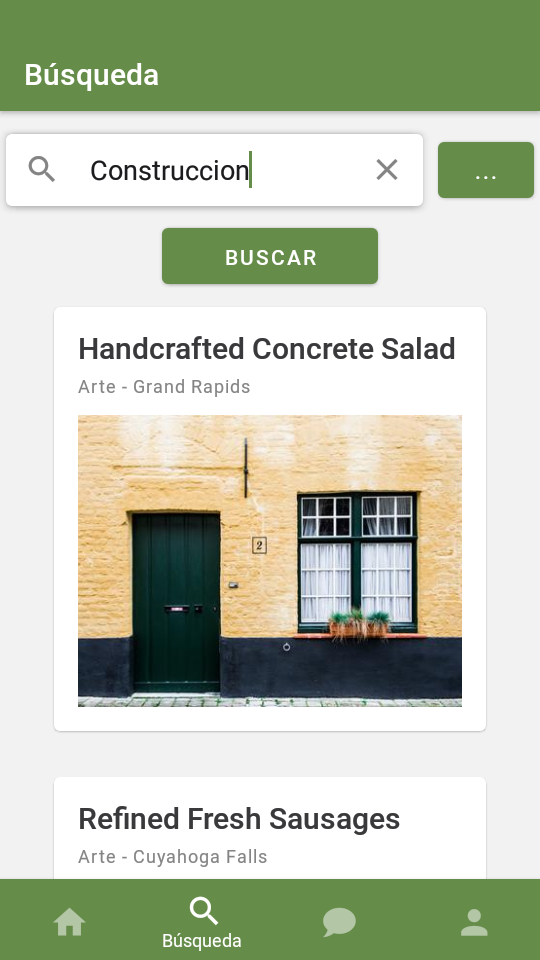

2. Puede presionar en los tres puntos junto al campo de búsqueda para acceder a otros tipos de búsqueda o filtros. Puede realizar búsquedas de acuerdo a múltiples filtros.

3. Los resultados de la búsqueda se muestran de a grupos, puede presionar alguna de las flechas en los botones inferiores para acceder a más resultados.

4. Si un proyecto llama su atención puede tocar en cualquier parte de la tarjeta para inspeccionarlo en detalle. Las características de los proyectos se discuten en secciones siguientes.

   

### Características de proyecto

1. Al abrir el detalle de un proyecto identifica su título y junto a este un botón para suscribirse a las notificaciones y otro para añadirlo a la lista de favoritos. Debajo de las fotos, que se exploran deslizando hacia la derecha. Se informan de izquierda a derecha la categoría, cantidad de patrocinadores y cantidad de favoritos totales.  Le sigue la descripción general de proyecto.

   
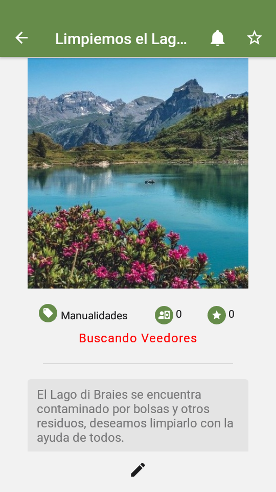

2. Debajo de la descripción  se encuentra un indicador del estado del proyecto y  la casilla donde puede realizar una contribución monetaria si es que se encuentra en estado de financiamiento.

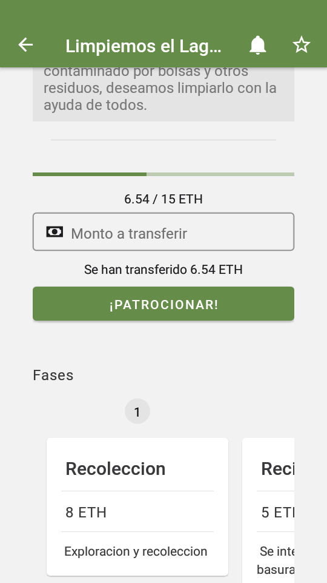

3.  El detalle de las fases da cuenta de la organización temporal y estructura del proyecto, nuevamente puede deslizar hacia la izquierda para explorarlas. 

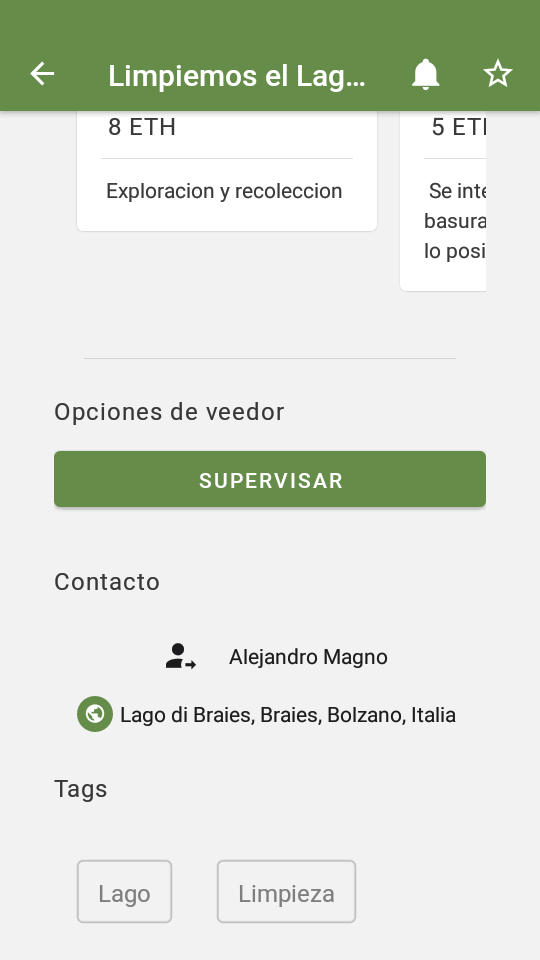

4. Finalmente se informa el autor, ubicación y tags asociadas al proyecto. Puede inspeccionarse los detalles de la cuenta del autor tocando el ícono que se encuentra a la izquierda de su nombre.

### Patrocinio de proyectos

1. Cuando un proyecto puede recibir fondos se habilita una sección de patrocinio debajo de la descripción.

2. Especifique un monto y seleccione ¡PATROCINAR! Aparecerá una pantalla de confirmación.

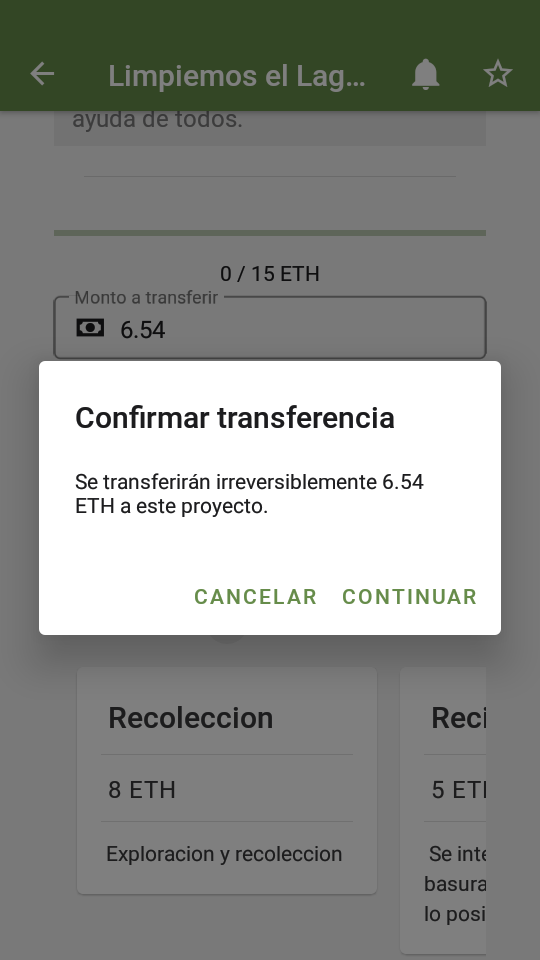

3. Seleccione CONTINUAR.

4. Se informará la cantidad aportada. Si el proyecto se encuentra próximo a su financiamiento total, puede que acabe aportando menos de lo esperado

   

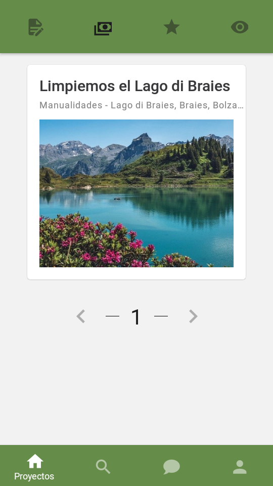

5. Puede consultar un historial de patrocinios en la segunda pestaña de la sección de proyectos.

## Creación de proyectos

Todo usuario puede crear nuevos proyectos para su posterior financiamiento.

1. Desde la pantalla de inicio seleccionar Crear Proyecto.

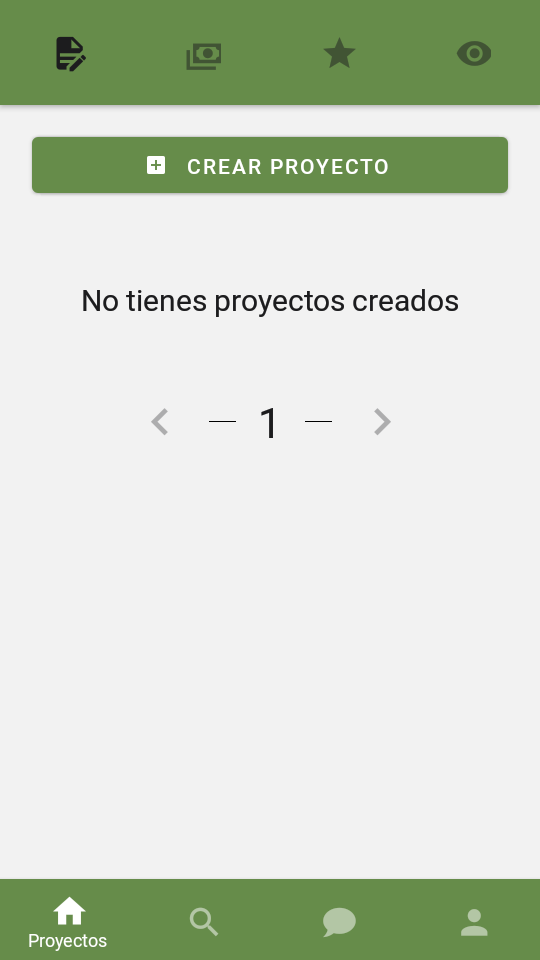

2. Comenzar con un título, de preferencia corto y concreto y añada imágenes seleccionando el botón con el símbolo +.

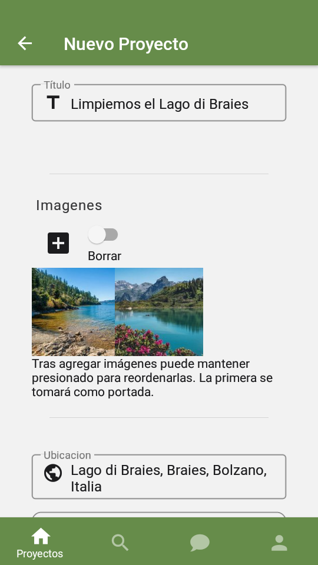

3. Puede añadir tantas imágenes como desee. Puede reordenarlas manteniendo presionado sobre la imágen que se desea trasladar y arrastrándolo a la posición preferida. La primer imágen (en la esquina superior izquierda) es la que actúa como portada del proyecto ante búsquedas. También es posible borrar imágenes seleccionando el switch 'Borrar' y tocando las imágenes que se quiere eliminar.

5. Luego, elija la ubicación en donde se llevará a cabo su proyecto. Es importante que seleccione una de las opciones provistas, no se aceptan ubicaciones personalizadas.

6. Continúe a la sección de categoría y toque el campo de texto para abrir un menú de opciones. Elija la que más se adecúe a su situación.

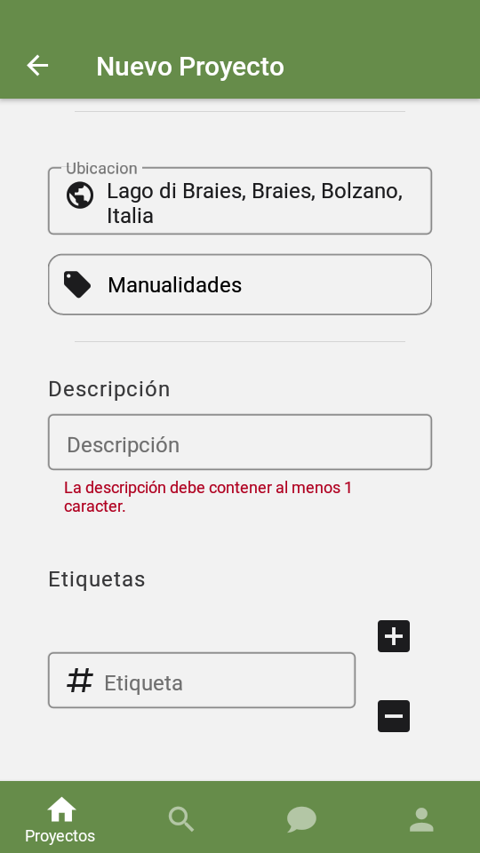

7. Provea una descripción general del proyecto. Omita detalles económicos, concéntrese en transmitir objetivos y motivaciones. Puede editar la descripción más tarde para comunicar cambios de planes o anuncios relevantes.

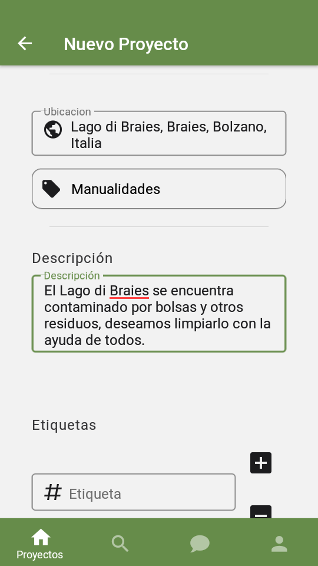

8. Elija las etiquetas con las que se podrá identificar su proyecto en una búsqueda.  Utilice el botón con el símbolo '+ para agregarla, puede eliminar etapas con el botón de símbolo '-' .

   
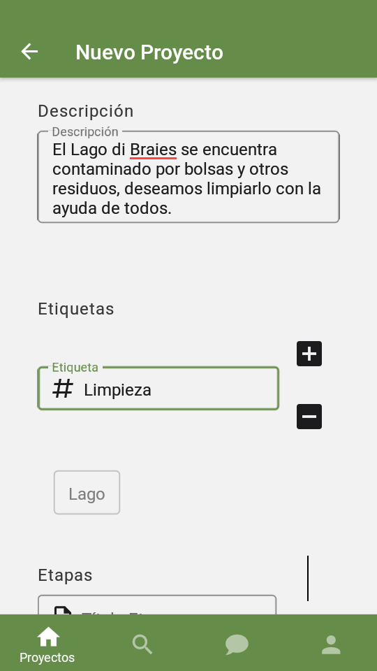

9. La sección de etapas es donde se comunican los objetivos económicos intermedios en los que se divide el proyecto general. Un proyecto debe tener al menos una etapa. A diferencia de la descripción las etapas son inmutables, esquematice su proyecto con especial cuidado.

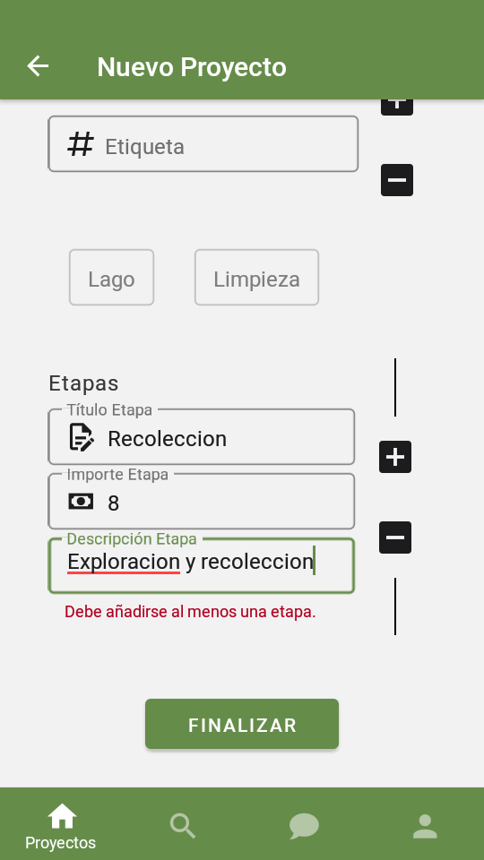

9.  Completar los campos y tocar el botón con el símbolo '+ para agregarla, puede eliminar etapas con el botón de símbolo '-' .

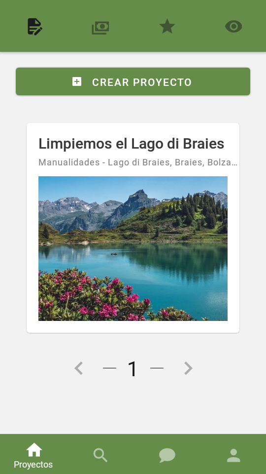

10. Seleccione Finalizar y , si ha seguido correctamente los pasos indicados se lo redirigirá a la página principal, en donde se listará su nuevo proyecto para su posterior seguimiento y/o modificación.

## Consultas privadas

Como parte de nuestra misión para conectar personas se proveen mecanismos de comunicación, para resolver dudas o discutir contribuciones por fuera de la aplicación.

1. Al final de los detalles de un proyecto se lista su autor. Puede explorar más detalles sobre el mismo tocando el ícono que se ubica a la izquierda de su nombre.

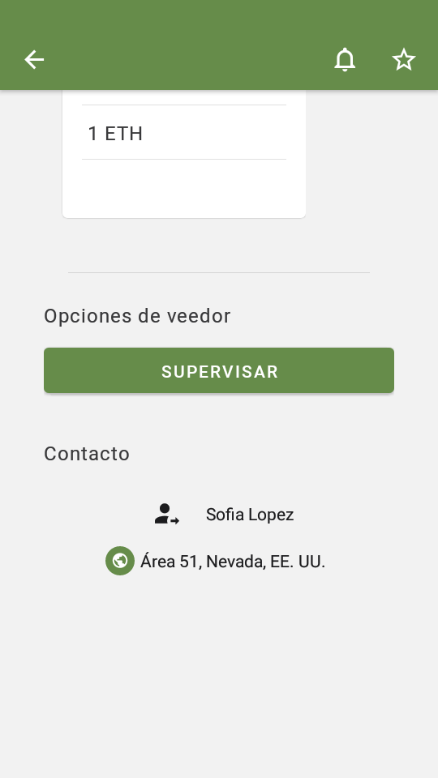

2. El detalle de cuentas ajenas provee el correo con el que el mismo se ha registrado, pero la aplicación incluye un chat privado para facilitar la comunicación. 

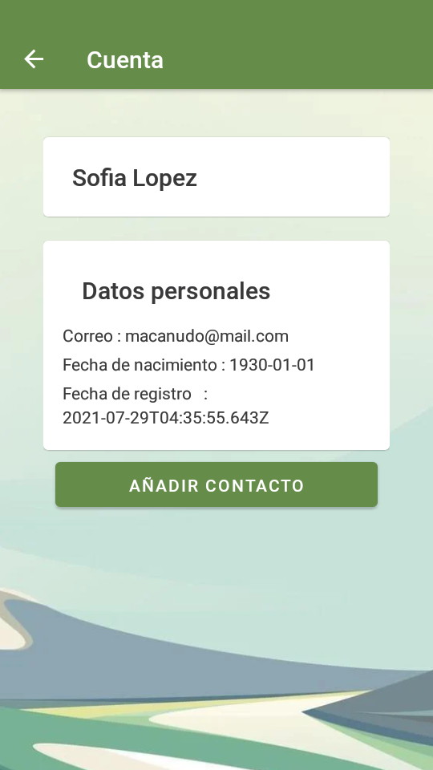

3. Seleccione  Añadir contacto y será redirigido a la pestaña de Contactos. La tercera en la barra inferior. Seleccione su nuevo contacto para abrir el chat.

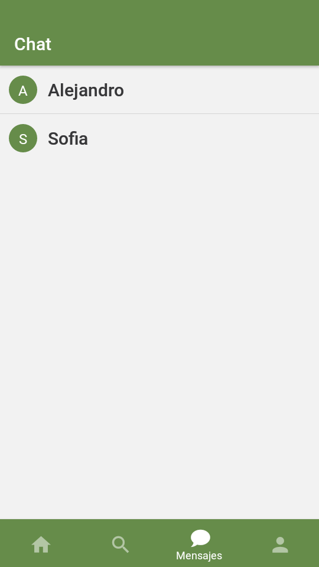

4. Dentro del chat escriba un mensaje y presione el ícono a la derecha del campo de texto para enviárlo.

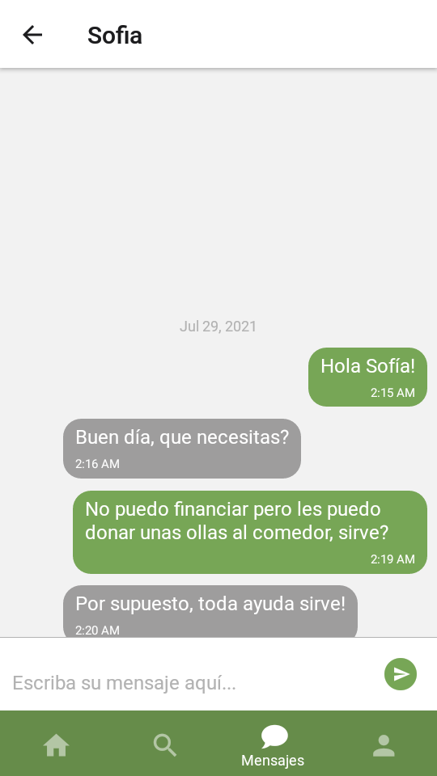

5. Puede visitar esta pestaña y continuar su conversación cuando lo desee.

## Veeduría

Un veedor supervisa el avance de proyectos y aprueba la liberación progresiva de fondos.

### Aplicar para veeduría

1. Diríjase a Cuenta.

   
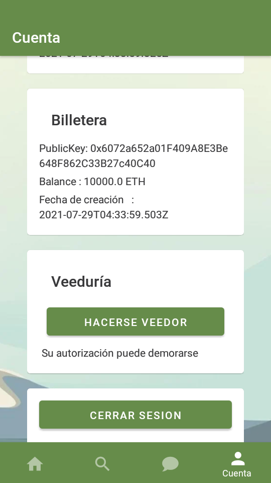

2. Seleccione aplicar para Veeduría. Su solicitud puede demorar en ser aprobada.

3. Cuando se apruebe su solicitud, se indicará en la misma sección donde aplicó.

   
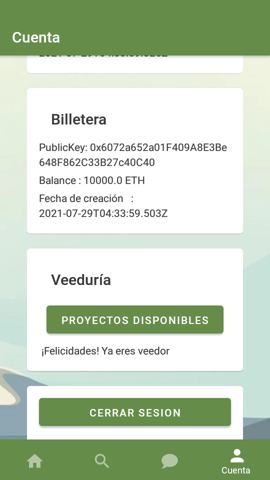

   

### Explorando proyectos en busca de veedores

1. Los proyectos recién creados no figuran en búsquedas normales, en cambio se listan en una sección especial con símbolo de ojo en la pestaña de proyectos. Alternativamente puede visitar dicha sección dirigiéndose a Cuenta y presionando el botón que utilizó inicialmente para aplicar para veedor.

   
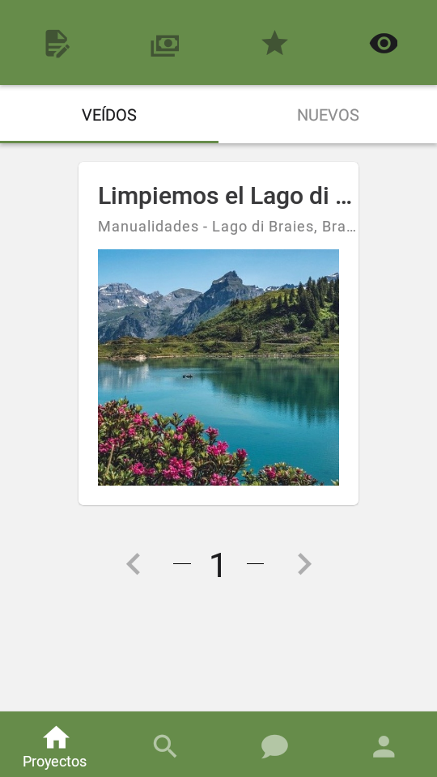

2. La sección de veeduría se divide en dos pestañas: La pestaña izquierda contiene un listado de los proyectos que ha supervisado, mientras que  la pestaña derecha contiene un listado de los proyectos que buscan veedores.

   

3. Navegue hacia el proyecto deseado tal y como se describe en el apartado de exploración de proyectos.

   

4. Dentro del proyecto encontrará un nuevo botón 'Supervisar'. Al presionarlo se inscribe como veedor en el proyecto. Se recomienda habilitar las notificaciones para facilitar el seguimiento.

   

   

### Supervisión de proyectos

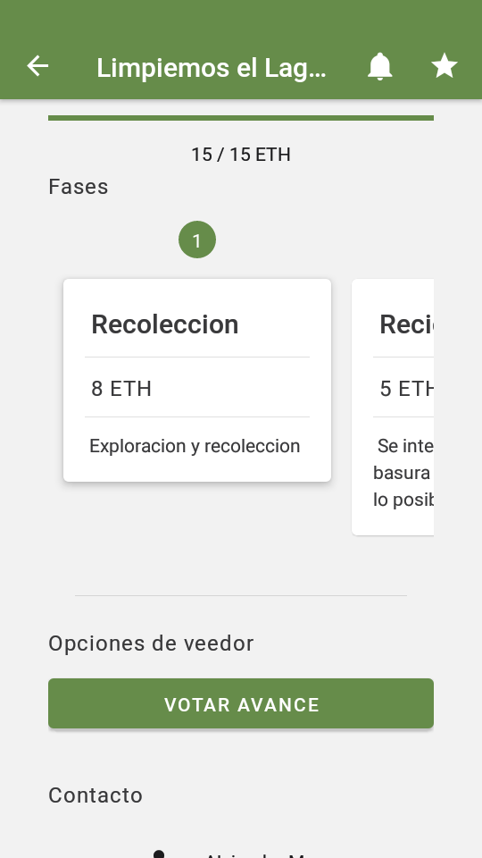

Cuando a un proyecto aplican 3 veedores, éste pasa a la etapa de financiamiento. Su tarea comienza cuando el proyecto se financia por completo. A partir de entonces deberá expedir su voto para liberar los fondos de cada una de las fases que el dueño indicó, para ello se habilitará un botón dentro del proyecto supervisado. Se realiza un voto por cada etapa, y se necesita un voto unánime para avanzar hacia la siguiente.

## Notificaciones

Si lo desea puede recibir notificaciones sobre los avances de un proyecto.

1. Ingrese al proyecto sobre el cual desea recibir notificaciones.

   
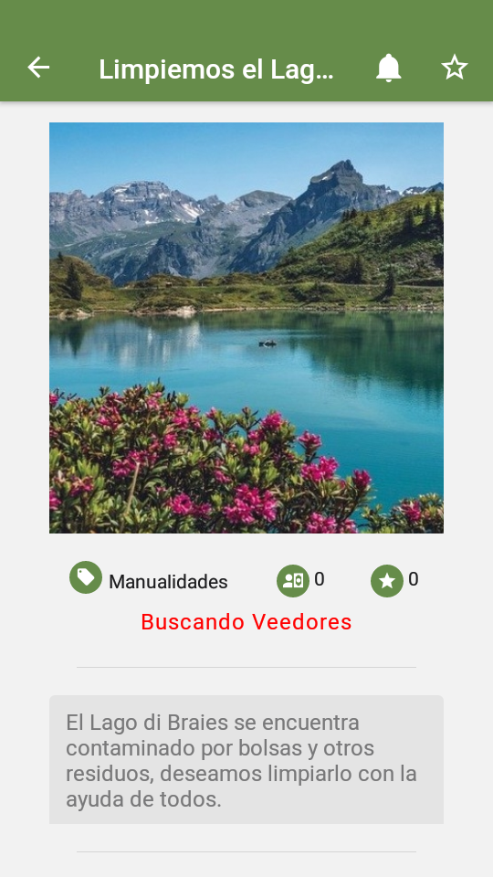

2. Seleccione la campañita ubicada en la barra superior.

3. Puede volver a seleccionar la campañita para dejar de recibir notificaciones.

Cuando se crea un proyecto, el dueño se suscribe automáticamente al proyecto, pero puede abandonar el servicio de notificaciones siguiendo los pasos expuestos previamente.
